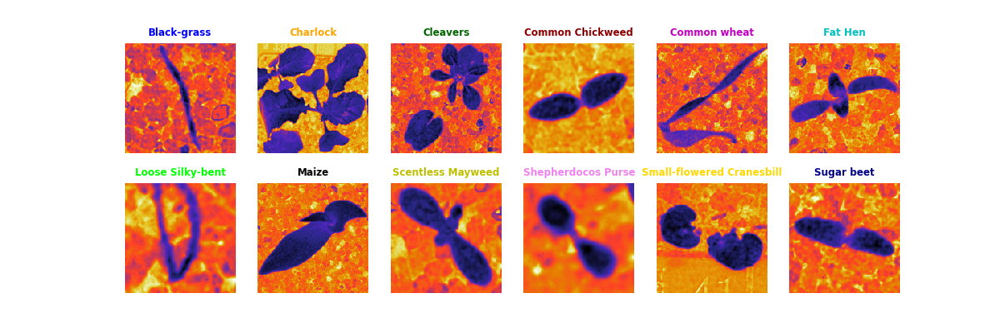

<h1 align="center"> Plant Seedlings Project </h1>
</img>

**Table des matières :**

- [Introduction](#section-1)
  - [Objectifs du pojet](#sous-section-11)
  - [Présentation du jeu de données](#sous-section-12)
- [Analyse exploratoire des données (EDA)](#section-2)
  - [Visualisation des images de différentes classes](#sous-section-20)
  - [Pixelisation & Répartition des classes](#sous-section-21)
  - [Statistiques descriptives sur les données](#sous-section-23)
  - [Distribution des tailles d'images](#sous-section-24)
  - [Analyse de la couleur des images](#sous-section-25)
- [Prétraitement des données](#section-3)
  - [Redimensionnement des images](#sous-section-31)
  - [Normalisation des valeurs de pixel](#sous-section-32)
  - [Augmentation de données (le cas échéant)](#sous-section-33)
  - [Création des ensembles d'entraînement, de validation et de test](#sous-section-34)
- [Construction et entraînement du modèle](#section-4)
  - [Sélection de l'architecture du modèle (CNN, DNN, MLP etc..)](#sous-section-41)
  - [Mise en place du modèlel](#sous-section-42)
  - [Configuration de l'entraînement (hyperparamètres, fonction de perte, optimiseur)](#sous-section-43)
  - [Entraînement du modèle sur les données](#sous-section-44)
- [Évaluation du modèle](#section-5)
  - [Évaluation des performances du modèle](#sous-section-51)
  - [Mesures des metriques](#sous-section-52)
  - [Matrice de confusion](#sous-section-53)
  - [Courbes ROC (le cas échéant)](#sous-section-54)
  - [Analyse des erreurs de classification](#sous-section-54)
- [Amélioration du modèle](#section-6)
  - [Réglage des hyperparamètres](#sous-section-61)
  - [Utilisation de modèles pré-entraînés (transfer learning)](#sous-section-62)
  - [Entraînement sur des données supplémentaires (le cas échéant)](#sous-section-63)
  - [Réévaluation des performances après les améliorations.](#sous-section-64)
- [Visualisation des résultats](#section-7)
  - [Visualisation des prédictions du modèle sur de nouvelles images](#sous-section-71)
- [Conclusion](#section-8)
  - [Récapitulation des résultats et des conclusions](#sous-section-81)
  - [Possibilités d'extensions ou de travaux futurs](#sous-section-82)
- [Références](#section-9)
  
## <a name="section-1"></a>[Introduction](#section-1) 

<p align="left">Les plantes jouent un rôle vital dans notre environnement et notre quotidien. Elles fournissent de la nourriture, de l'oxygène, et contribuent à la beauté de notre monde naturel. Cependant, la classification et la reconnaissance des différentes espèces de plantes peuvent s'avérer être un défi complexe pour les biologistes  et les chercheurs en sciences de l'environnement et naturel. C'est là que l'apprentissage automatique et la vision par ordinateur interviennent pour nous aider à résoudre ce problème si complexe. </p>

Le jeu de données [Kaggle V2 Plant Seedlings Dataset](https://www.kaggle.com/datasets/vbookshelf/v2-plant-seedlings-dataset) offre une opportunité passionnante d'exploration et de comprendre la diversité des plantes à travers une approche informatique basé sur du **deep learning**. Composé d'une collection d'images de semis de plantes appartenant à différentes espèces, ce jeu de données représente un défi intéressant pour la classification automatisée des plantes. En utilisant des techniques de deep learning avancées(CNN, RNN, RCNN etc..) et de traitement d'images (Segmentation d'image), nous pouvons développer un modèle qui sera capable de reconnaître et de classer les plantes en fonction de leurs caractéristiques visuelles, détecter également les possibles 
maladies pouvant attaquer ces dernière. 

### <a name="sous-section-11"></a>[Ojectifs du projet](#sous-section-11)
<p align="left"> L'objectif de ce projet est de créer un modèle de classification d'images capable de distinguer efficacement avec une très bonne précision entre les différentes espèces de plantes présentes dans le jeu de données. Pour ce faire, nous allons explorer les images, prétraiter les données, construire un modèle d'apprentissage profond, l'entraîner sur un ensemble de données d'entraînement et évaluer ses performances sur un ensemble de données de test et validation. Tout au long de ce projet, nous allons également mettre l'accent sur l'analyse des résultats pour mieux comprendre les performances du modèle et identifier les défis spécifiques posés par la classification des plantes et voir comment améliorer notre modèle. </p>

<p align="left">Ce projet ne se limite pas seulement à la création d'un modèle de classification, mais il offre également une opportunité d'exploration visuelle des données, de compréhension des techniques d'augmentation de données et d'analyse des erreurs de classification. En fin de compte, notre objectif est d'utiliser les capacités de l'apprentissage automatique pour contribuer à la recherche en botanique et à la préservation de la biodiversité en identifiant automatiquement les espèces de plantes à partir d'images.</p>

<p align="left">Dans les sections suivantes, nous allons plonger plus profondément dans les détails du jeu de données, de l'exploration des données à la construction du modèle, en passant par l'évaluation des performances. Nous espérons que ce projet servira de base pour d'autres applications de classification d'images dans le domaine de la botanique et de la biologie.</p>

### <a name="sous-section-12"></a>[Présentation du jeu de données](#sous-section-12)

Le jeu de données [Kaggle V2 Plant Seedlings Dataset](https://www.kaggle.com/datasets/vbookshelf/v2-plant-seedlings-dataset) est un ensemble de données couramment utilisé dans le domaine de la vision par ordinateur [REF. 1](https://www.kaggle.com/code/allunia/computer-vision-with-seedlings/notebook) et de l'apprentissage automatique pour la classification d'images de plantes [REF. 2](https://www.researchgate.net/publication/332677611_An_Improved_Deep_Neural_Network_for_Classification_of_Plant_Seedling_Images). Ce jeu de données est hébergé sur la plateforme [Kaggle](https://www.kaggle.com/), qui est une communauté de data scientists et de chercheurs en science des données.

Comme décrit plus haut dans la section <a name="section-11"></a>[Ojectifs du projet](#sous-section-11), l'objectif principal de ce jeu de données est de permettre la classification automatique des semis de plantes en fonction de leur espèce. Il s'agit d'une tâche de classification multi-classe, où chaque image est étiquetée avec l'espèce de plante correspondante.

Le jeu de données comprend les éléments suivants :

> [Images]() : Le jeu de données contient un ensemble d'images en couleur(**RGB** ou **GGBA**) représentant des semis de plantes. Chaque image est associée à    une étiquette qui indique l'espèce de la plante.

> [Classes]() : Il existe plusieurs classes d'espèces de plantes dans ce jeu de données. Chaque classe correspond à une espèce spécifique de plante. Parmi les espèces incluses, on trouve des plantes telles que le maïs, le pissenlit, le chénopode, la renouée, la moutarde sauvage, et d'autres *voir tableau ci-dessous*.

> Taille du Jeu de Données : Le jeu de données contient un nombre significatif d'images(**5539**), avec plusieurs centaines d'images pour chaque classe. Cependant La taille totale du jeu de données peut varier en fonction de la version spécifique que vous utilisez. Ici c'est la version V2 du dataset.

| __Noms d'espèces__                    | __Nombre de plantes par espèce__ | __RGBA (RGB + canal alpha)__  |__[Total]()__|
|---------------------------------------|----------------------------------|-----------------------------|------|
| __Black-grass__                       | __309__               | __3__|
| __Charlock__                          | __452__               | __0__|
| __Cleavers__                          | __335__               | __0__|
| __Common Chickweed__                  | __713__               | __0__|
| __Common wheat__                      | __253__               | __0__|
| __Fat Hen__                           | __538__               | __0__|
| __Loose Silky-bent__                  | __762__               | __21__|
| __Maize__                             | __257__               | __0__|
| __Scentless Mayweed__                 | __607__               | __0__|
| __Shepherdoco Purse__                 | __274__               | __0__|
| __Small-flowered Cranesbill__         | __576__               | __0__|
| __Sugar beet__                        | __463__               | __0__|
|  __[Total]()__                        | __[5539]()__                     | __[24]()__      |__[12 espèces]()__|

- Valeurs Statistiques

|__Min__        | __Max__     | __Mean__         | __Med__        | __std__       | __Q1__         | __Q3__       | __IQ__        |
|---------------|-------------|------------------|----------------|---------------|----------------|--------------|---------------|
|  __[253]()__  | __[762]()__ | __[462.6]()__    | __[457.5]()__  | __[179.3]()__ | __[300.3]()__  |__[583.8]()__ | __[283.5]()__ |

## <a name="section-2"></a>[Analyse exploratoire des données (EDA)](#section-2)
### <a name="sous-section-20"></a>[Visualisation des images de différentes classes](#sous-section-20)
#### Espace colorimétrique RGB (Red, Green, Blue) :


L'espace RGB est basé sur les trois canaux de couleur primaires, à savoir le **rouge (R), le vert (G) et le bleu (B)**. Chaque pixel d'une image est représenté par une combinaison de ces trois canaux, ce qui permet de reproduire une large gamme de couleurs.
L'espace RGB est couramment utilisé dans le traitement d'images et la vision par ordinateur [REF. 6](https://openaccess.thecvf.com/content_eccv_2018_workshops/w31/html/Hesse_Computer_Vision_for_Medical_Infant_Motion_Analysis_State_of_the_ECCVW_2018_paper.html). Il est adapté à de nombreuses tâches, y compris la classification d'images, la détection d'objets, la segmentation d'images segmentiques[REF. 5](https://towardsdatascience.com/semantic-segmentation-popular-architectures-dff0a75f39d0), [REF. 4](https://nanonets.com/blog/semantic-image-segmentation-2020/).
Il est intuitif, largement utilisé et convient bien à de nombreuses applications de vision par ordinateur [REF. 6](https://openaccess.thecvf.com/content_eccv_2018_workshops/w31/html/Hesse_Computer_Vision_for_Medical_Infant_Motion_Analysis_State_of_the_ECCVW_2018_paper.html), [REF. 7](https://www.sciencedirect.com/science/article/abs/pii/S0168169919313249).

#### Espace colorimétrique RGR2-LAB (CIELAB) :

L'espace LAB est un espace colorimétrique qui est conçu pour être perceptuellement uniforme, ce qui signifie que les distances entre les couleurs dans cet espace sont plus cohérentes avec la perception humaine de la couleur que dans l'espace RGB. Il se compose de trois composantes : **la luminosité (L), l'axe vert-rouge (A) et l'axe bleu-jaune (B)**.
L'espace LAB est souvent utilisé pour des tâches où la perception de la couleur par l'œil humain est importante. Il est fréquemment utilisé en imagerie médicale, en conception graphique et en analyse de la couleur.
Il est adapté à des tâches où la précision de la correspondance des couleurs est cruciale. L'espace LAB est indépendant du périphérique, ce qui signifie qu'il est moins sensible aux variations de couleur dues aux différents écrans et appareils.

L'utilisation de deux espaces colorimétriques (RGB et LAB) peut être intéressante pour explorer différentes approches de prétraitement des images et évaluer comment ces espaces affectent les performances de votre modèle.  Nous allons voir comment l'utilisation de l'espace RGR2-LAB 
peut faciliter la segmentation de l'image sémantique, et débruité une image avec une éfficacité redoutable.

### <a name="sous-section-21"></a>[Pixelisations & Répartition des classes](#sous-section-21)


Les deux graphiques ci-dessus présentent la répartition du nombre de pixels et du nombre de plantes par espèce. De ces graphiques, deux observations importantes se dégagent :

> Étant donné que la taille d'un pixel est définie comme $pixel = (largeur * hauteur)$, on constate une concentration des valeurs autour de l'intervalle [0.1, 0.4] mega pixels, indiquant une certaine hétérogénéité dans les données, ainsi que la présence de quelques valeurs aberrantes donc la plus grande valeur est de 3.6 Mega Pixels.

> On remarque également que le nombre d'exemplaires varie d'une espèce à l'autre avec une certaine disparité dans l'histogramme en bar.

Pour obtenir un modèle de deep learning performant, il est essentiel que tous les échantillons aient la même taille(normalisation du dataset). Par conséquent, la normalisation de ce jeu de données est nécessaire, tout comme l'utilisation de la data augmentation(**voir plus tard**).

Afin d'atteindre l'objectif d'une taille d'échantillonnage uniforme, la normalisation des données est cruciale. La data augmentation joue également un rôle fondamental dans ce processus. En utilisant des techniques de data augmentation telles que la rotation, le redimensionnement et le recadrage, nous pouvons générer des versions modifiées des images existantes, les rendant cohérentes en termes de taille.

Cela permet non seulement d'améliorer la qualité et la diversité du jeu de données, mais aussi d'augmenter la robustesse du modèle de deep learning en l'entraînant sur une variété d'angles et de perspectives des données. Ainsi, un modèle formé sur un jeu de données normalisé et augmenté est plus susceptible de généraliser correctement lorsqu'il est confronté à de nouvelles données.

## Strategies:

## Methods :

## Acknowledgement :

## <a name="section-1"></a>[Analyse exploratoire des données (EDA)](#section-2)
- [REF. 1](https://www.kaggle.com/code/allunia/computer-vision-with-seedlings/notebook)
- [REF. 2](https://www.researchgate.net/publication/332677611_An_Improved_Deep_Neural_Network_for_Classification_of_Plant_Seedling_Images)
- [REF. 3](https://fr.wikipedia.org/wiki/Segmentation_d%27image)
- [REF. 4](https://nanonets.com/blog/semantic-image-segmentation-2020/)
- [REF. 5](https://towardsdatascience.com/semantic-segmentation-popular-architectures-dff0a75f39d0)
- [REF. 6](https://openaccess.thecvf.com/content_eccv_2018_workshops/w31/html/Hesse_Computer_Vision_for_Medical_Infant_Motion_Analysis_State_of_the_ECCVW_2018_paper.html)
- [REF. 7](https://www.sciencedirect.com/science/article/abs/pii/S0168169919313249)
## Authors : 
* __**```Dr. Iréné A.E```**__
* __**```Olivier M.```**__ 
* __**```Hassan Z.```**__
* __**```Gilles D.P```**__

## 🤝 Support 
Give a ⭐ if you like this project!

## License 
Copyrihght © 2023 __**Iréné A.E, Olivier M., Hassan Z., Gilles D.P**__

This project is licensed under [MIT License](https://github.com/amiehe-essomba/Plant_Seedlings_ds_Project/blob/Plant_Seedlings/LICENSE)

[citation](https://vision.eng.au.dk/plant-seedlings-dataset/)